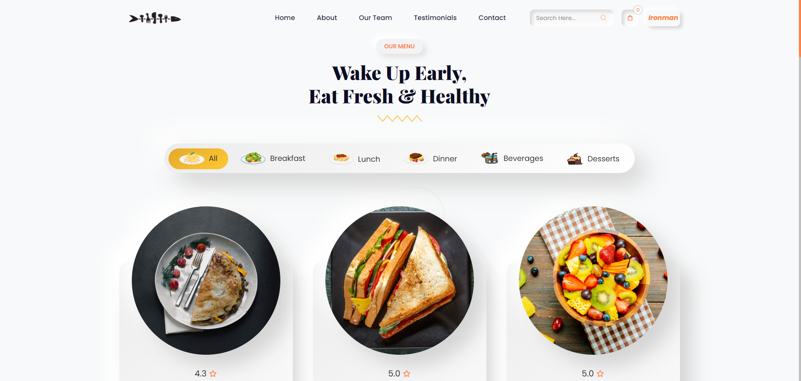

# Food Ordering Website
As the name says it all, it a simple full stack project which is used for ordering food from your favourite restaurant. It is a user friendly and responsive website. 

## Features :
- The project has two interface i.e. an user interface and an admin interface.
- At user-end he/she can ony order food and set the quantity as per there requirment.
- At user-end he/she can also view there profile details and order history.
- At user-end he/she can change their basic contact details and as well as there password. 
- At admins-end he/she can perform two task : 
    - Add new food to the food menu.
    - Change the price of cuisine as per inflation rate.
    - View and dispatch order of the customers.
- Admin can also verify the working of the website from his own end.
- Use cookies for login into the account.

## Build With :
<ul>
    <li><a href="https://www.w3schools.com/html/" target="_blank">HTML</a></li>
    <li><a href="https://www.w3schools.com/css/" target="_blank">CSS</a></li>
    <li><a href="https://www.w3schools.com/js/" target="_blank">JavaScript</a></li>
    <li><a href="https://www.w3schools.com/bootstrap5/index.php" target="_blank">Bootstrap</a></li>
    <li><a href="https://expressjs.com/" target="_blank">ExpressJS</a></li>
    <li><a href="https://www.w3schools.com/mysql/default.asp" target="_blank">MySQL</a></li>
</ul>

## Install and Run :
- Clone the repository or download the zip folder.
- Extract the zip folder.
- Import the data from the ``` FoodOrderingWebsite.sql ``` file to your ``` MySQL``` Database.
- Install NodeJS in your system.
- Go to the folder where you have extracted or cloned the project.
- Open command prompt or terminal having the same location where your project is.
- Type ``` npm install ``` in your command prompt or terminal.
- Now to run the project on your server type ``` npm start ``` .

## Screenshot :
Here are some of the screenshot of Food Ordering Website.

1. Landing Page :<br><br> <br><br>
2. SignUp  Page :<br><br> <br><br>
3. SignIn Page :<br><br> <br><br>
4. Home Page : <br><br> <br><br>
5. Menu List : <br><br> <br><br>
6. Cart Page : <br><br> <br><br>
7. Confirmation Page :<br><br> <br><br>
8. Details and Order History Page :<br><br> <br><br>
9. Settings Page :<br><br> <br><br>
10. Sign Out Option :<br><br> <br><br>
11. Admin Sign In Page : <br><br> <br><br>
12. Admin Welcome Page :<br><br> <br><br>
13. Admin Adding Food Page :<br><br> <br><br>
14. Changing Price of Cuisine :<br><br> <br><br>
14. Admin Order View & Dispatching Page :<br><br> <br><br>